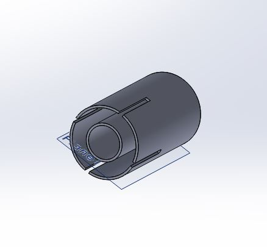
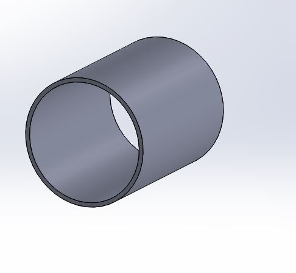
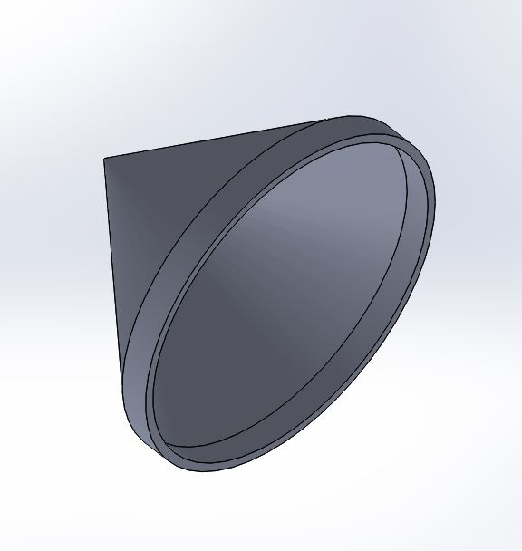
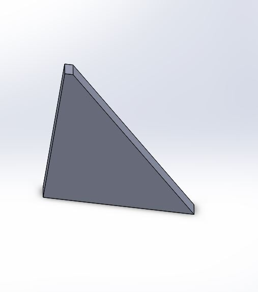
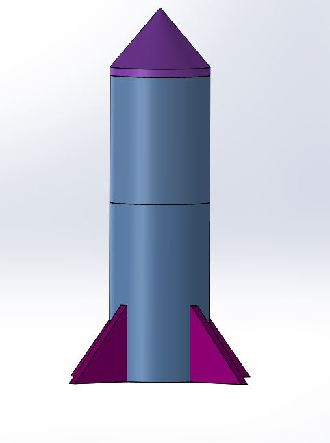
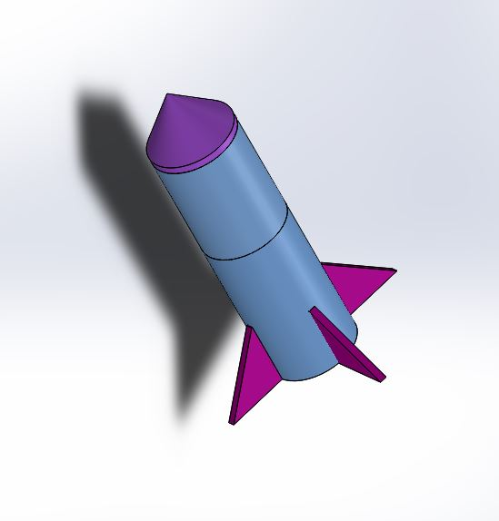
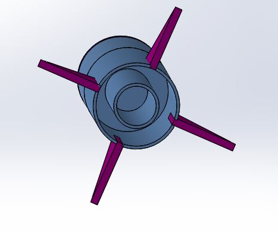

# Pi-In-the-Sky
# Timeline
We were able to finish SoliWorks, print it out and put it together fairly quickly. We spent about two weeks working on the actual rocket.
However, the code had slowed us down a bit in our schedule. Some of it was easy because wer already had code for it, but we had some trouble trying to figure out how to collect the data of the accelerometer. As well we had forgotten how to power the pi wirelessly.
# Pictures
       
    
  
