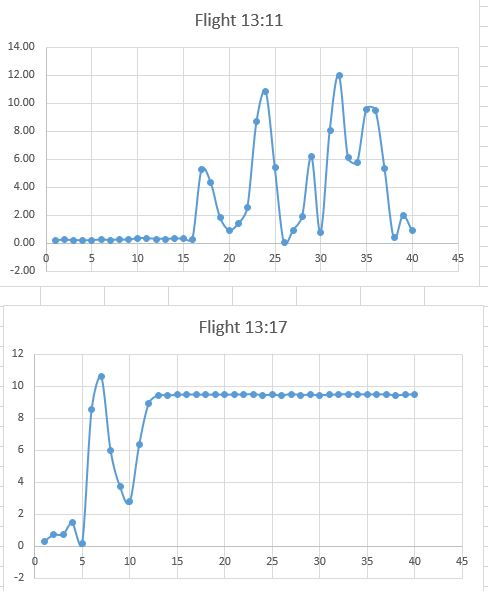

# Pi-In-the-Sky
# Timeline
We were able to finish SoliWorks, print it out and put it together fairly quickly. We spent about two weeks working on the actual rocket.
However, the code had slowed us down a bit in our schedule. Some of it was easy because wer already had code for it, but we had some trouble trying to figure out how to collect the data of the accelerometer. As well we had forgotten how to power the pi wirelessly.
# Pictures
       
    
#Results
  
These were two seperate launches that we performed and both clearly had rather different results. The first one even we had trouble interpreting because the ammount of change in the direction of the graph is very random. Because we had such a hard time evebn getting data, we didn't know which files exactly lined up with what flight. For the first we belive it may have been on of our tests where we just threw the pi up to test on Dr.Sheilds' phone. The second one we belive to have been one of our actual rocket launches. So the naturaly the big arc is the launch and the plateu at the end is when the rocket was caught and held. After many confusing launches we finally got this data. Our pi had not been creating the data file when we launched it even though it had worked when hooked up to the computer. Dr.Shields told us that this had happened to a previous student and they couldn't figure it out either. We had Dr. Shields use an SSH connection to collect the data as if it were connected to the computer. 
 #Lessons learned
 We learned a lot of leasons through this project. Most importantly that we should always ask questions. For much of the time we didn't want to ask anyone for help so we ended up being stuck on little things for a long time. We also learned that sometimes things just don't work. We had so much trouble trying to get our pi to collect the data not attatched to the pi and none of us, not even Dr. Shields knew how to fix it. And when it became clear that that would not work we found a way to complete the project.
