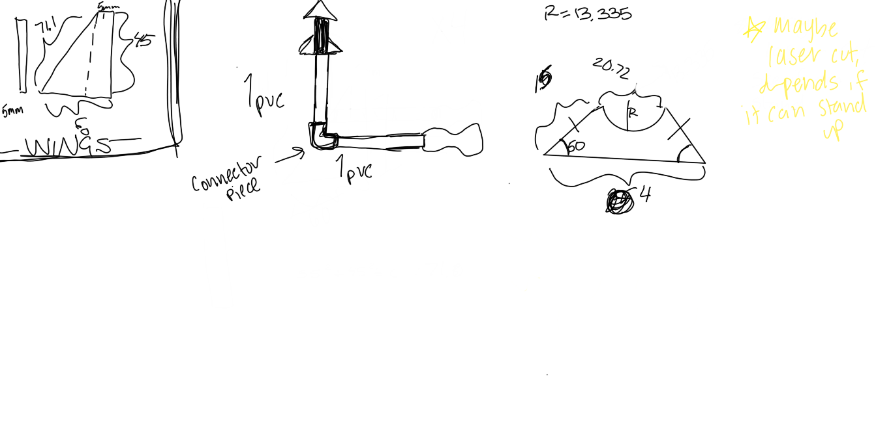
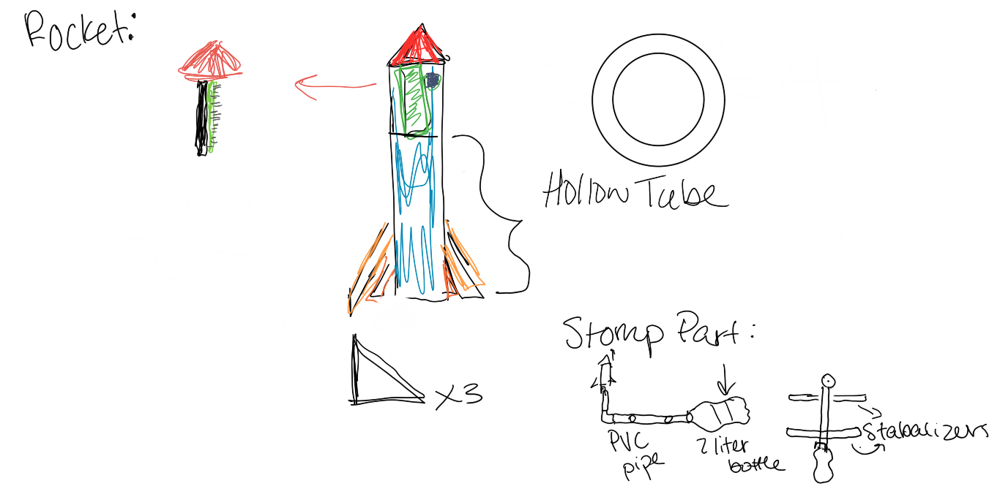
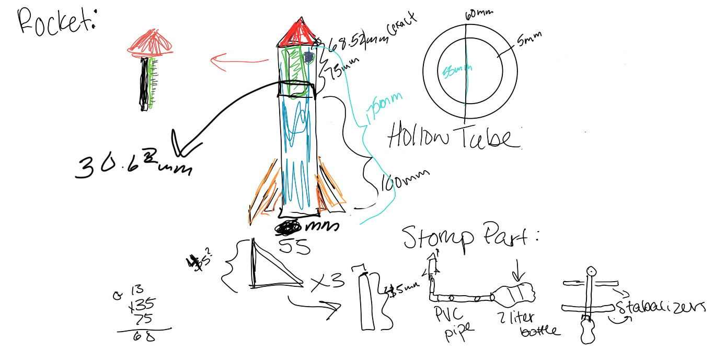

#Pi in the Sky 

The problem:
We need to put our pi in th sky and have it measure the acceleration of the time it is in the air. When it has reached its maximum hieght, it should make a noise.

This is where documentation of Pi in the Sky preoject will go.
For our project, we want to launch our raspberry pi into the sky using a stomp rocket. We are going to make the stomp rocket out of PVC pipes and 2 liter bottles. Then for our actual pi, we are going to be building a rocket. 

This is the link for our rough sketch of our pi stomp rocket: (50x50)   

# Materials
1. PVC pipes (2 pipes and a connector)
2. 2 liter bottle 
3. acrylic 
4. Raspberry pi 
5. accelerometer 
6. battery

# Timeline
3/11-3/22: Design the rocket in solidworks

3/25-4/17: Finish the coding for our project

4/18-4/26: Print and put together the rocket and the launcher

4/29-5/10: Test and fix any last minute errors

5/13-5/17: Cushion week if any one part takes longer than expected
